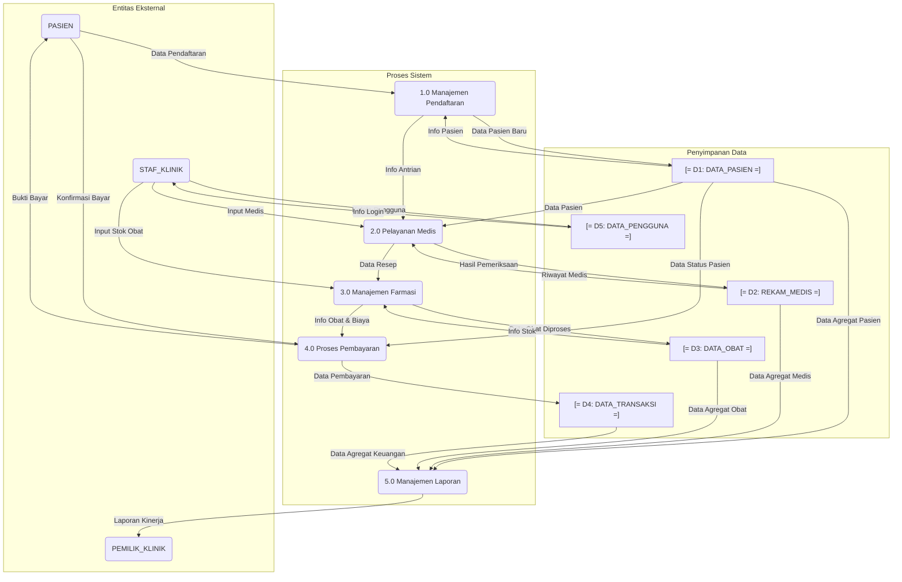

# Sistem Analisis dan Desain - Data Flow Diagram (DFD)

Dokumen ini menjelaskan aliran data dalam Sistem Informasi Klinik Sentosa. DFD ini memvisualisasikan bagaimana informasi masuk, diproses, disimpan, dan keluar dari sistem. Model ini dibuat berdasarkan analisis prototipe.

## 1. Komponen DFD

- **Entitas Eksternal**: Sumber atau tujuan data di luar batas sistem (misalnya: Aktor). Direpresentasikan dengan format `[ENTITAS]`.
- **Proses**: Aktivitas yang mentransformasikan data. Direpresentasikan dengan format `(PROSES)`.
- **Aliran Data**: Jalur pergerakan data. Direpresentasikan dengan format `--- Nama Aliran Data --->`.
- **Penyimpanan Data (Data Store)**: Tempat data disimpan untuk digunakan di lain waktu. Direpresentasikan dengan format `[= PENYIMPANAN_DATA =]`.

## 2. DFD Level 0 (Diagram Konteks)

Diagram Konteks adalah pandangan tingkat tertinggi yang menunjukkan seluruh sistem sebagai satu proses tunggal.

```
[PASIEN] --- Data Pendaftaran, Info Pasien ---> (SISTEM KLINIK SENTOSA)
[PASIEN] <--- Bukti Bayar, Info Layanan --- (SISTEM KLINIK SENTOSA)

[STAF_KLINIK] <--> Data Medis, Data Obat, Data Pembayaran <--> (SISTEM KLINIK SENTOSA)

[PEMILIK_KLINIK] <--- Laporan Kinerja --- (SISTEM KLINIK SENTOSA)
```
- **Deskripsi**: Sistem menerima data dari Pasien dan Staf Klinik. Sistem memberikan informasi kembali kepada Pasien dan Staf, serta menghasilkan laporan untuk Pemilik Klinik.

## 3. DFD Level 1

DFD Level 1 memecah `(SISTEM KLINIK SENTOSA)` menjadi proses-proses utama.



### **Deskripsi Aliran Data (DFD Level 1):**

1.  **Proses 1.0: Manajemen Pendaftaran**
    - `[PASIEN]` memberikan `Data Pendaftaran` ke proses `(1.0)`.
    - `(1.0)` memvalidasi dan menyimpan `Data Pasien Baru` ke `[= D1: DATA_PASIEN =]`.
    - `(1.0)` juga dapat membaca `Info Pasien` dari `[= D1: DATA_PASIEN =]` untuk pendaftaran pasien lama.
    - `(1.0)` mengirim `Info Antrian` ke proses `(2.0)`.

2.  **Proses 2.0: Pelayanan Medis**
    - `[STAF_KLINIK]` (Perawat/Dokter) memberikan `Input Medis` (data vital, hasil konsultasi) ke proses `(2.0)`.
    - `(2.0)` membaca `Data Pasien` dari `[= D1: DATA_PASIEN =]` dan `Riwayat Medis` dari `[= D2: REKAM_MEDIS =]`.
    - `(2.0)` menyimpan `Hasil Pemeriksaan` baru ke dalam `[= D2: REKAM_MEDIS =]`.
    - Jika ada, `(2.0)` mengirimkan `Data Resep` ke proses `(3.0)`.

3.  **Proses 3.0: Manajemen Farmasi**
    - `(3.0)` menerima `Data Resep` dari `(2.0)`.
    - `(3.0)` membaca `Info Stok` dari `[= D3: DATA_OBAT =]` untuk verifikasi ketersediaan.
    - Setelah diproses, `(3.0)` meng-update stok dengan mengirim `Data Obat Diproses` ke `[= D3: DATA_OBAT =]`.
    - `(3.0)` mengirim `Info Obat & Biaya` ke proses `(4.0)`.
    - `[STAF_KLINIK]` (Apoteker) juga dapat memberikan `Input Stok Obat` langsung ke `(3.0)`.

4.  **Proses 4.0: Proses Pembayaran**
    - `(4.0)` menerima `Info Obat & Biaya` dari `(3.0)` dan mengambil data lain dari `[= D1: DATA_PASIEN =]` (untuk status diskon) dan `[= D2: REKAM_MEDIS =]` (untuk biaya konsultasi).
    - `(4.0)` menyajikan total tagihan kepada `[PASIEN]`.
    - Setelah `[PASIEN]` melakukan `Konfirmasi Bayar`, `(4.0)` menyimpan `Data Pembayaran` ke `[= D4: DATA_TRANSAKSI =]`.
    - `(4.0)` menghasilkan `Bukti Bayar` untuk `[PASIEN]`.

5.  **Proses 5.0: Manajemen Laporan**
    - `(5.0)` membaca data agregat dari semua data store (`D1`, `D2`, `D3`, `D4`).
    - `(5.0)` menghasilkan `Laporan Kinerja` yang dikirimkan kepada `[PEMILIK_KLINIK]`.

6.  **Interaksi dengan Data Store Pengguna**
    - `[STAF_KLINIK]` (Admin) berinteraksi dengan `[= D5: DATA_PENGGUNA =]` untuk `Kelola Pengguna`.
    - Semua `[STAF_KLINIK]` divalidasi melalui `Info Login` dari `[= D5: DATA_PENGGUNA =]` saat mengakses sistem.
